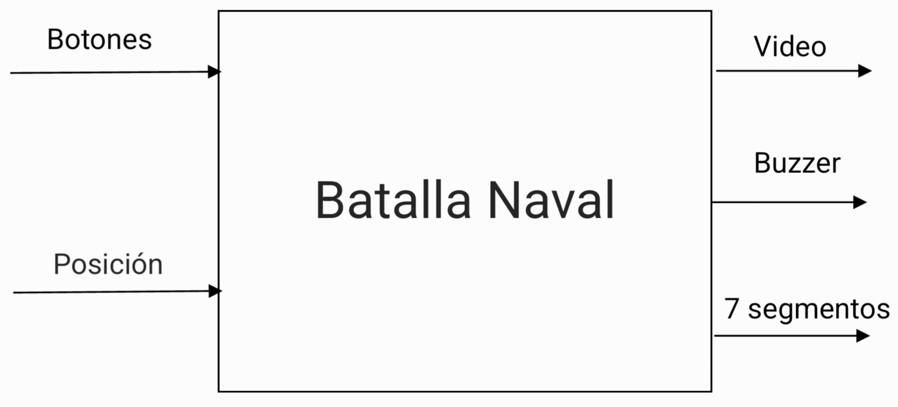

# Diseño Juego Batalla Naval
**Integrantes**

**Dennis Manuel Arce Alvarez**  
*Escuela de Ingeniería Electrónica*  
*Tecnológico de Costa Rica*  
Carné: 2018151568

**Brayan Díaz Ruiz**  
*Escuela de Ingeniería Electrónica*  
*Tecnológico de Costa Rica*  
Carné: 2018203585

**Joan Franco Sandoval**  
*Escuela de Ingeniería Electrónica*  
*Tecnológico de Costa Rica*  
Carné: 2020248356

**Steven Sancho Orozco**  
*Escuela de Ingeniería Electrónica*  
*Tecnológico de Costa Rica*  
Carné: 2019015506

*Fecha:*
---

## Primer Nivel: Descripción General del Sistema

---

## Segundo Nivel: Arquitectura de Subsistemas

---

## Tercer Nivel:

---

## Cuarto Nivel
