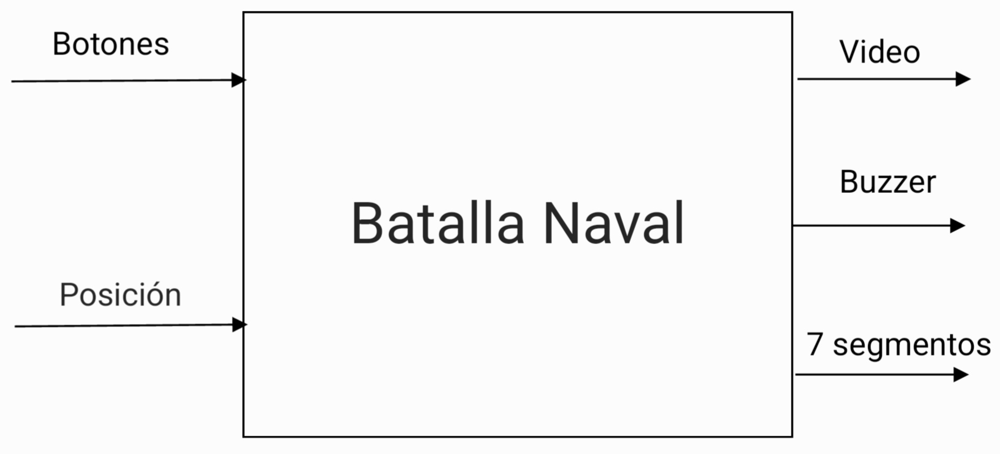

# Diseño Juego Batalla Naval
**Integrantes**

**Dennis Manuel Arce Alvarez**  
*Escuela de Ingeniería Electrónica*  
*Tecnológico de Costa Rica*  
Carné: 2018151568

**Brayan Díaz Ruiz**  
*Escuela de Ingeniería Electrónica*  
*Tecnológico de Costa Rica*  
Carné: 2018203585

**Joan Franco Sandoval**  
*Escuela de Ingeniería Electrónica*  
*Tecnológico de Costa Rica*  
Carné: 2020248356

**Steven Sancho Orozco**  
*Escuela de Ingeniería Electrónica*  
*Tecnológico de Costa Rica*  
Carné: 2019015506

*Fecha:*
---

## Primer Nivel: Descripción General del Sistema
En este primer nivel se describe la funcionalidad básica del juego, donde el sistema recibe las entradas de los jugadores y el posicionamiento de los barcos, y el sistema saca las señales de video, buzzer y displays.

---

## Segundo Nivel: Arquitectura de Subsistemas
Para el segundo nivel, se diferencian las entradas de los jugadores en botones para el jugador 2 y entradas por medio de un aplicación de PC para el jugador 1. Las entradas del J1 se comunican al sistema por medio comunicación serial con UART. El sistema tiene un procesador que maneja la lógica del juego y un módulo árbitro que comunica los periféricos con el procesador.

---

## Tercer Nivel:
Para el tercer nivel, se especifican el nombre de cada señal que entra y salen de los periféricos y los módulos de cada uno de estos. El microprocesador se plantea con una arquitectura RISCV. El módulo "Árbitro" será el encargado de cuales señales recibe el procesador según la dirección que entre a este módulo. El módulo Displays maneja el control para el LED de estado de la partida y displays de 7 segmentos que permitiran observar el marcador del juego.

El módulo Buzzer emite tonos al inicio de cada etapa de juego y cuando se cumplan ciertas condiciones durante la partida como acertar a un barco, fallo el tiro, hundir un barco, ganar la partida, etc. El módulo UART se encargará de comunicar la aplicación de PC con el sistema, esto por medio de un UART serial. El módulo Periférico VGA, maneja el control de la pantalla y lo que se muestra en esta, no cuenta con lógica del juego, únicamente, tiene el control de como se muestran los datos en pantalla.

---

## Cuarto Nivel
### Módulo Procesador
#### a) Diagrama / Diseño

#### b) Objetivo del módulo
#### c) Entradas

| Entrada | Descripción |
|---|---|
| `clk_i` | Señal de reloj del sistema. |
| `rst_i` | Señal de reset del sistema. |
| `ProgIn_i` | Señal de entrada de instrucciones. |
| `DataIn_i` | Señal de entrada de datos. |

#### d) Salidas

| Salida | Descripción |
|---|---|
| `ProgAddress_o` | Señal de dirección de instrucciones. |
| `DataAddress_o` | Señal de dirección de datos. |
| `DataOut_o` | Señal de salida de datos. |
| `we_o` | Señal de salida de "Write Enable". |

#### e) Relación con otros módulos
#### f) Explicación de funcionamiento

### Módulo Árbitro
#### a) Diagrama / Diseño

#### b) Objetivo del módulo
#### c) Entradas

| Entrada | Descripción |
|---|---|
| `DataAddress_o` | Señal de dirección de datos. |
| `rdata_mem` | Señal de datos leídos desde RAM. |
| `rdata_displays` | Señal de datos leídos desde módulo Displays. |
| `rdata_buzzer` | Señal de datos leídos desde módulo Buzzer. |
| `rdata_btns` | Señal de datos leídos desde módulo Debouncer. |
| `rdata_pc` | Señal de datos leídos desde módulo UART. |
| `rdata_vga` | Señal de datos leídos desde periférico VGA. |
| `we_o` | Señal de entrada de "Write Enable". |

#### d) Salidas

| Entrada | Descripción |
|---|---|
| `DataIn_i` | Señal de salida de datos. |
| `we_mem` | Señal de salida de "Write Enable" para RAM. |
| `we_displays` | Señal de salida de "Write Enable" para módulo Displays. |
| `we_buzzer` | Señal de salida de "Write Enable" para módulo Buzzer. |
| `we_btns` | Señal de salida de "Write Enable" para módulo Debouncer. |
| `we_pc` | Señal de salida de "Write Enable" para módulo UART. |
| `we_vga` | Señal de salida de "Write Enable" para periférico VGA. |

#### e) Relación con otros módulos
#### f) Explicación de funcionamiento

### Módulo Displays
#### a) Diagrama / Diseño

#### b) Objetivo del módulo
#### c) Entradas

| Entrada | Descripción |
|---|---|
| `clk_i` | Señal de reloj del sistema. |
| `rst_i` | Señal de reset del sistema. |
| `DataAddres_o` | Señal de dirección de datos. |
| `DataOut_o` | Señal de entrada de datos. |
| `we_displays` | Señal de entrada de "Write Enable" para módulo Displays. |

#### d) Salidas

| Salida | Descripción |
|---|---|
| `rdata_displays` | Señal de datos leídos desde módulo Displays. |

#### e) Relación con otros módulos
#### f) Explicación de funcionamiento

### Módulo Buzzer
#### a) Diagrama / Diseño

#### b) Objetivo del módulo
#### c) Entradas

| Entrada | Descripción |
|---|---|
| `clk_i` | Señal de reloj del sistema. |
| `rst_i` | Señal de reset del sistema. |
| `DataAddres_o` | Señal de dirección de datos. |
| `DataOut_o` | Señal de entrada de datos. |
| `we_buzzer` | Señal de entrada de "Write Enable" para módulo Buzzer. |

#### d) Salidas

| Salida | Descripción |
|---|---|
| `rdata_buzzer` | Señal de datos leídos desde módulo Buzzer. |

#### e) Relación con otros módulos
#### f) Explicación de funcionamiento

### Módulo Debouncer Botones
#### a) Diagrama / Diseño

#### b) Objetivo del módulo
#### c) Entradas

| Entrada | Descripción |
|---|---|
| `clk_i` | Señal de reloj del sistema. |
| `rst_i` | Señal de reset del sistema. |
| `DataAddres_o` | Señal de dirección de datos. |
| `DataOut_o` | Señal de entrada de datos. |
| `we_btns` | Señal de entrada de "Write Enable" para módulo Debouncer. |

#### d) Salidas

| Salida | Descripción |
|---|---|
| `rdata_btns` | Señal de datos leídos desde módulo Debouncer. |

#### e) Relación con otros módulos
#### f) Explicación de funcionamiento

### Módulo Periférico UART
#### a) Diagrama / Diseño

#### b) Objetivo del módulo
#### c) Entradas

| Entrada | Descripción |
|---|---|
| `clk_i` | Señal de reloj del sistema. |
| `rst_i` | Señal de reset del sistema. |
| `DataAddres_o` | Señal de dirección de datos. |
| `DataOut_o` | Señal de entrada de datos. |
| `we_pc` | Señal de entrada de "Write Enable" para módulo UART. |
| `rx_fisico` | Señal RX desde PC a UART. |

#### d) Salidas

| Salida | Descripción |
|---|---|
| `rdata_pc` | Señal de datos leídos desde módulo UART. |
| `tx_fisico` | Señal TX desde UART a PC. |

#### e) Relación con otros módulos
#### f) Explicación de funcionamiento

### Módulo Periférico VGA
#### a) Diagrama / Diseño

#### b) Objetivo del módulo
#### c) Entradas

| Entrada | Descripción |
|---|---|
| `clk_i` | Señal de reloj del sistema. |
| `clk_25` | Señal de reloj de 25 MHz. |
| `DataAddres_o` | Señal de dirección de datos. |
| `DataOut_o` | Señal de entrada de datos. |
| `we_vga` | Señal de entrada de "Write Enable" para periférico VGA. |

#### d) Salidas

| Salida | Descripción |
|---|---|
| `rdata_vga` | Señal de datos leídos desde periférico VGA. |
| `screen_o` | Señal de color y posicionamiento de los pixeles en la pantalla. |

#### e) Relación con otros módulos
#### f) Explicación de funcionamiento
